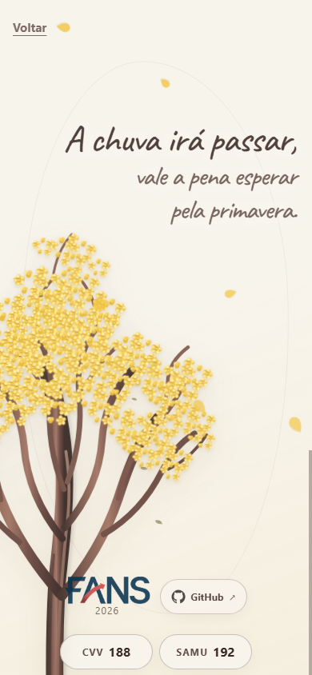

# Setembro Amarelo — experiência web mobile

**Prazo de entrega:** quarta-feira, 23/09/2026<br>
**Instituição:** Faculdade FANS<br>
**Natureza:** trabalho acadêmico com concessão de horas complementares<br>
**Público principal:** estudantes da faculdade, predominantemente entre 18 e 26 anos<br>
**Idioma:** português brasileiro

## 1. Visão do projeto

O projeto é uma landing page interativa para a campanha do Setembro Amarelo. O acesso acontecerá principalmente por QR codes exibidos nos telões da faculdade, portanto a experiência deve ser pensada primeiro para celulares em orientação vertical.

A página deve transmitir acolhimento, calma e esperança por meio de uma narrativa visual breve. A experiência combina texto, ilustrações vetoriais e animações suaves, mas nunca pode atrasar ou dificultar o acesso aos telefones de apoio.

O tom será equilibrado: poético e emocional, sem ser excessivamente dramático, e informativo quando apresentar os contatos.

## 2. Princípios do produto

1. **Ajuda sempre acessível:** `CVV 188` e `SAMU 192` permanecem disponíveis desde a primeira tela.
2. **Mobile first:** a composição principal é vertical, adequada ao acesso por QR code em celulares.
3. **Experiência guiada:** os quadros ocupam aproximadamente uma tela e se alinham ao final da rolagem.
4. **Usuário no controle:** toque, arrasto e navegação convencional permitem avançar sem esperar uma animação.
5. **Aprimoramento progressivo:** textos e contatos continuam acessíveis caso o JavaScript ou uma animação falhe.
6. **Privacidade:** não haverá formulários, cookies, rastreadores, analytics ou coleta de dados.
7. **Acessibilidade:** o projeto adotará WCAG nível AA como referência.

## 3. Contatos de apoio

Os contatos aparecerão próximos ao rodapé de todos os quadros, centralizados horizontalmente e lado a lado:

- **CVV 188** — apoio emocional;
- **SAMU 192** — emergência ou risco imediato.

### Comportamento

- Cada contato será um link telefônico: `tel:188` e `tel:192`.
- O toque abrirá a tela de ligação do aparelho; o site não inicia chamadas sozinho.
- Os rótulos serão visualmente discretos, com opacidade levemente reduzida, sem comprometer o contraste WCAG AA.
- A área interativa de cada contato terá pelo menos 44 × 44 CSS pixels, preferencialmente 48 × 48.
- Os contatos usarão fonte sem serifa de alta legibilidade, não a fonte manuscrita.
- Os links sempre ficarão acima das ilustrações e partículas animadas.
- Não haverá link para chat ou outro canal de atendimento.

## 4. Fluxo da experiência

### Quadro 1 — primeiro contato

Ao abrir o site, a tela exibe apenas a palavra:

> Olá.

O texto usará uma fonte manuscrita simples, sem floreios excessivos.

#### Linha do tempo

| Intervalo | Estado |
| --- | --- |
| 0 a 1 s | A palavra é desenhada traço a traço, como escrita à mão. |
| 1 a 2,5 s | A palavra permanece completamente visível. |
| 2,5 a 3 s | A palavra desaparece suavemente. |
| Após 3 s | O Quadro 2 é apresentado automaticamente. |

Durante o Quadro 1:

- a rolagem entre quadros permanece bloqueada;
- os links `CVV 188` e `SAMU 192` permanecem visíveis e funcionais;
- um toque em uma área vazia conclui imediatamente a sequência atual e avança para o Quadro 2;
- toques nos contatos não são interpretados como comando para pular a animação;
- não haverá botão textual “Pular introdução”.

### Quadro 2 — acolhimento

O quadro apresenta:

> Você não está sozinho(a).

Elementos visuais:

- laço amarelo desenhado por uma animação de traço em SVG;
- indicador discreto apontando para baixo;
- texto `Voltar` no canto superior esquerdo;
- contatos de apoio próximos ao rodapé.

O texto surge com transição suave após o Quadro 1. O laço é desenhado como uma fita que se forma na tela. O indicador realiza um movimento vertical sutil e cílico.

#### Interação de avanço

- O usuário pode arrastar o indicador aproximadamente 30 px para cima.
- Ao atingir esse limiar, o site completa automaticamente a transição para o Quadro 3.
- Um toque simples no indicador produz o mesmo resultado, garantindo acessibilidade.
- O controle deve responder a toque, clique, `Enter` e barra de espaço.
- Um toque em uma área vazia durante a animação mostra imediatamente o estado final do quadro.
- O texto `Voltar` retorna ao Quadro 1 e reinicia sua animação.

### Quadro 3 — esperança e apoio

O quadro apresenta o poema autoral:

> A chuva irá passar,<br>
> vale a pena esperar pela primavera.

O poema não exige atribuição externa.

#### Árvore e folhas

- A ilustração será um ipê-amarelo vetorial, orgânico e florido, inspirado na referência visual fornecida.
- No celular, a árvore ficará parcialmente enquadrada à esquerda.
- O tronco será levemente sinuoso e inclinado para a direita.
- A árvore entrará completa no quadro de baixo para cima, acompanhando a transição.
- As folhas cairão continuamente na diagonal, da esquerda para a direita.
- Folhas e árvore ficarão atrás do poema, dos contatos e dos elementos do rodapé.
- As folhas não poderão capturar toques nem provocar deslocamento do layout.

#### Rodapé acadêmico

O final do quadro conterá, nesta ordem:

1. logo da Faculdade FANS, apenas visual e sem link;
2. ano `2026`;
3. badge do GitHub com ícone e texto, apontando para [github.com/sgalbiero/setembro-amarelo](https://github.com/sgalbiero/setembro-amarelo).

A logo será adicionada como `assets/fans-logo.png`. O badge abrirá o repositório em uma nova aba e deverá informar essa mudança de contexto de forma acessível.

O texto `Voltar`, no canto superior esquerdo, retornará ao Quadro 2.

## 5. Navegação e comportamento mobile

### Encaixe entre quadros

- Cada quadro terá aproximadamente a altura da área visível.
- Após a introdução, a rolagem será liberada.
- A navegação usará `scroll-snap` para conduzir o usuário ao quadro mais próximo e evitar repouso entre duas telas.
- O encaixe será firme, mas não deverá aprisionar a rolagem nem impedir acesso a conteúdo que cresça por zoom ou tamanho de fonte.
- A transição por gesto e a rolagem nativa devem terminar no mesmo estado visual.
- Voltar a um quadro reinicia suas animações.

### Dimensões e áreas seguras

- Usar unidades modernas de viewport, com `100svh` como base e `100dvh` quando apropriado.
- Considerar `env(safe-area-inset-top)` e `env(safe-area-inset-bottom)` em aparelhos com recortes ou indicador de início.
- Nenhum texto, controle ou telefone pode ser cortado pelas barras do navegador.
- O conteúdo deve poder crescer verticalmente quando houver zoom, texto ampliado ou orientação horizontal.
- A orientação vertical é prioritária, mas a horizontal deve permanecer funcional.

### Prioridade de eventos

1. Links e controles interativos tratam o toque recebido.
2. Arrastar o indicador inicia a mudança de quadro.
3. Tocar em área vazia conclui a animação atual.
4. A rolagem nativa movimenta a experiência após a introdução.

## 6. Identidade visual

### Direção artística

A aparência será poética e artesanal, com ilustrações vetoriais geométricas e toques minimalistas. O projeto terá somente tema claro.

### Paleta inicial

| Uso | Valor sugerido |
| --- | --- |
| Fundo | `#f7f6f2` ou `#f5f4f0` |
| Texto principal | `#3e2723` ou `#2d1b19` |
| Destaque | amarelo inspirado no Setembro Amarelo |
| Badge do GitHub | cinza médio levemente suavizado |

As cores finais devem ser validadas em conjunto, com contraste mínimo de 4,5:1 para texto comum e 3:1 para texto grande e componentes relevantes.

### Tipografia

- **Textos emocionais:** Caveat, armazenada localmente no projeto.
- **Contatos, controles e informações acadêmicas:** pilha de fontes sem serifa do sistema.
- A fonte Caveat deve incluir os caracteres usados em português.
- O arquivo de licença SIL Open Font License da Caveat deve acompanhar a fonte. Isso não define a licença do restante do projeto.
- Se a fonte personalizada falhar, o conteúdo deve continuar legível por meio de uma fonte alternativa adequada.

## 7. Animações e estados

### Regras gerais

- As animações devem manter 60 fps em celulares atuais sempre que possível.
- Priorizar `transform` e `opacity`, evitando propriedades que provoquem recálculo constante de layout.
- Partículas decorativas devem ser limitadas e reutilizadas.
- Nenhuma animação pode impedir a ativação dos telefones.
- Não haverá áudio, reprodução automática ou controle de som.
- Não haverá controle manual para pausar animações.

### Interrupção por interação

Quando o usuário tocar em uma área vazia durante uma animação:

- a animação atual é concluída imediatamente;
- o quadro assume seu estado visual final;
- a animação contínua da árvore e das folhas não é interrompida por essa regra;
- o evento não pode ser disparado por links, botões ou pelo controle de arrasto.

### Movimento reduzido

Com `prefers-reduced-motion: reduce`:

- remover o efeito de escrita à mão e a espera inicial;
- remover o desenho animado do laço;
- remover o movimento do indicador;
- remover a entrada animada da árvore e a queda das folhas;
- apresentar as ilustrações prontas e estáticas;
- preservar todos os textos, contatos e controles;
- manter a navegação direta entre os quadros, sem transições prolongadas.

## 8. Acessibilidade

O projeto buscará conformidade com WCAG AA e deverá:

- usar HTML semântico e uma hierarquia coerente de títulos;
- funcionar com toque, mouse, teclado e leitor de tela;
- exibir foco visível em todos os elementos interativos;
- manter ordem de foco compatível com a ordem visual;
- suportar zoom de pelo menos 200% sem perda de conteúdo ou funcionalidade;
- fornecer nomes acessíveis aos links de telefone, ao indicador, ao controle `Voltar` e ao badge do GitHub;
- marcar o laço, a árvore e as folhas como decorativos, ocultando-os da árvore de acessibilidade;
- não depender apenas de cor, movimento ou gesto de arrasto para transmitir informação;
- manter os contatos disponíveis mesmo durante o bloqueio inicial da rolagem;
- respeitar movimento reduzido;
- não deslocar automaticamente o foco do teclado entre os quadros.

## 9. Arquitetura técnica

O projeto será uma página estática, sem backend e sem framework de aplicação.

### Tecnologias

- HTML5 semântico;
- CSS3;
- JavaScript modular;
- SVG para laço, árvore e elementos decorativos;
- GSAP somente se trouxer ganho artístico ou técnico relevante em relação a CSS e JavaScript nativos.

Todas as dependências necessárias para exibição devem ser armazenadas localmente. O funcionamento da página não pode depender de CDN, Google Fonts ou outra conexão externa, exceto quando o visitante decidir abrir o repositório do GitHub.

### Estrutura planejada

```text
/setembro-amarelo
├── index.html
├── README.md
├── css/
│   └── style.css
├── js/
│   ├── main.js
│   └── animations.js
└── assets/
    ├── fonts/
    │   ├── caveat.woff2
    │   └── OFL.txt
    ├── fans-logo.png
    ├── laco.svg
    ├── arvore.svg
    └── github-icon.svg
```

### Falhas e degradação segura

- Sem JavaScript, todos os quadros devem ficar visíveis em sequência e a rolagem deve permanecer liberada.
- Se uma imagem não carregar, ela não pode ocultar texto nem contatos.
- Se a fonte local não carregar, utilizar uma fonte alternativa do sistema.
- Erros de animação não podem manter a página invisível ou permanentemente bloqueada.

## 10. Desempenho

Como o acesso ocorrerá por celular, a página deve:

- carregar rapidamente em conexões móveis;
- evitar bibliotecas e arquivos que não sejam utilizados;
- preferir SVG otimizado para ilustrações;
- reservar previamente o espaço de imagens e elementos para evitar saltos de layout;
- pausar ou reduzir animações decorativas quando o quadro estiver fora da tela;
- evitar excesso de folhas ou filtros gráficos caros;
- priorizar navegadores móveis atuais.

## 11. Matriz de testes

### Tamanhos obrigatórios

- 320 px;
- 360 px;
- 390 px;
- 412 px;
- 768 px;
- desktop.

### Ambientes prioritários

- Safari em iPhone;
- Chrome em Android;
- Chrome, Edge ou Firefox em desktop.

### Cenários funcionais

- abertura normal e transição automática do Quadro 1;
- toque para concluir cada animação;
- toque e arrasto do indicador;
- encaixe correto entre quadros;
- retorno ao quadro anterior;
- repetição das animações ao voltar;
- links `tel:` corretos;
- link do GitHub correto;
- funcionamento sem conexão depois de disponibilizados os arquivos locais;
- funcionamento sem JavaScript;
- navegação por teclado;
- leitura por tecnologia assistiva;
- zoom de 200%;
- movimento reduzido;
- orientação horizontal;
- verificação de contraste e de áreas de toque.

## 12. Capturas para documentação

Ao final da implementação, o README deverá receber:

1. captura do Quadro 1 em celular vertical;
2. captura do Quadro 2 em celular vertical;
3. captura do Quadro 3 em celular vertical;
4. captura da visão geral em desktop.

As imagens devem ficar em `docs/screenshots/`, com descrições alternativas objetivas.

## 13. Critérios de conclusão

O projeto estará pronto quando:

- os três quadros corresponderem ao fluxo descrito;
- os contatos estiverem sempre acessíveis e abrirem a tela de ligação;
- a navegação guiada funcionar por rolagem, toque, arrasto e teclado;
- o encaixe nunca deixar a tela repousando entre dois quadros;
- animações não bloquearem conteúdo ou controles;
- o modo de movimento reduzido apresentar uma experiência estática completa;
- a página funcionar sem dependências externas obrigatórias;
- todos os tamanhos e cenários da matriz de testes forem verificados;
- a documentação técnica e as quatro capturas estiverem no repositório.

## 14. Referências de conteúdo

- [CVV — Centro de Valorização da Vida](https://cvv.org.br/o-cvv/): atendimento pelo 188, gratuito e disponível 24 horas.
- [Ministério da Saúde — SAMU 192](https://www.gov.br/saude/pt-br/composicao/saes/samu-192): atendimento gratuito de urgência e emergência, 24 horas.
- [W3C — animações decorrentes de interação](https://www.w3.org/WAI/WCAG21/Understanding/animation-from-interactions.html): orientações sobre movimento e preferências do usuário.

## 15. Implementação concluída

A experiência foi implementada como uma página estática, sem framework, backend ou dependências de execução. O JavaScript foi dividido entre a coordenação da navegação (`js/main.js`) e o ciclo das animações (`js/animations.js`). CSS e APIs nativas do navegador foram suficientes para o resultado artístico; GSAP não foi incluído para manter o carregamento pequeno e o funcionamento offline simples.

### Decisões técnicas e visuais

- A composição usa fundo de papel claro, tinta marrom, amarelo quente e uma linha orgânica quase imperceptível em cada quadro.
- O laço é formado por um único percurso SVG com espessura de fita. O movimento começa na ponta inferior esquerda, sobe pela diagonal, contorna a volta superior da direita para a esquerda e termina descendo até a ponta inferior direita; a dobra sombreada surge apenas no fim do cruzamento. O ipê é um SVG local com tronco texturizado, copa amarela em camadas e grupos independentes de galhos e flores; esses grupos oscilam em ritmos discretamente diferentes para simular uma brisa, enquanto as pétalas que atravessam a cena são reutilizadas por CSS.
- A fonte variável Caveat foi armazenada como `assets/fonts/caveat.woff2`; sua licença SIL Open Font License está em `assets/fonts/OFL.txt`.
- A logo recebida na raiz foi movida sem alteração para `assets/fans-logo.png`.
- O bloqueio da introdução só existe depois que o módulo JavaScript inicia com sucesso. Sem JavaScript, os três quadros permanecem visíveis e navegáveis em sequência.
- Os quadros usam `100svh`/`100dvh`, áreas seguras e `scroll-snap`. Em telas horizontais ou baixas, o encaixe muda para `proximity` e o conteúdo pode crescer verticalmente, evitando aprisionamento por zoom.
- O toque em áreas vazias conclui apenas a animação atual. Links e controles têm prioridade; a queda contínua das folhas não é interrompida.
- Os contatos ficam um pouco mais altos no quadro inicial e descem nos quadros seguintes. O sinal de avanço perdeu o contorno circular e o conjunto FANS/GitHub foi centralizado acima dos telefones, seguindo o mesmo eixo visual.
- Em `prefers-reduced-motion: reduce`, a introdução não espera, o laço e a árvore aparecem prontos, o indicador não oscila e as folhas não caem.

### Validação executada

| Área | Resultado |
| --- | --- |
| Larguras | 320, 360, 390, 412, 768 e 1440 px sem estouro horizontal |
| Orientação horizontal | 844 × 390 px com conteúdo rolável e encaixe não restritivo |
| Áreas de toque | badges de telefone e GitHub com 44 px; indicador com 64 × 52 px; controles `Voltar` com 48 px |
| Fluxo | introdução automática de 3 s, conclusão por toque vazio, avanço por toque e arrasto de 30 px, retorno e reinício verificados |
| Teclado | ordem de foco sem deslocamento automático; indicador ativado por `Enter` e espaço |
| Telefones | seis ocorrências locais validadas como `tel:188` e `tel:192` |
| Movimento reduzido | espera, desenho, oscilação, entrada e folhas removidos; navegação direta preservada |
| Sem JavaScript | três quadros, títulos e seis telefones visíveis; rolagem total preservada |
| Zoom | escala de 200% com página rolável, contatos preservados e alvos maiores que 44 px |
| Contraste | texto principal 12,49:1; texto secundário 6,54:1; foco 5,94:1 sobre o fundo |
| Recursos locais | HTML, CSS, módulos, fonte, logo e SVGs responderam localmente sem erro |
| Sintaxe | módulos JavaScript e o utilitário de QA passaram em `node --check` |

Os testes automatizados foram executados no Chrome desktop e em viewports móveis emulados. O comportamento foi inspecionado pela árvore de acessibilidade do navegador. Safari em iPhone e Chrome em Android físicos não estavam disponíveis neste ambiente; recomenda-se um último teste rápido nesses aparelhos antes da apresentação, sobretudo para confirmar as barras dinâmicas do navegador e o acionamento do discador.

## 16. Capturas

### Quadro 1 — celular vertical


### Quadro 2 — celular vertical


### Quadro 3 — celular vertical



### Visão geral — desktop


