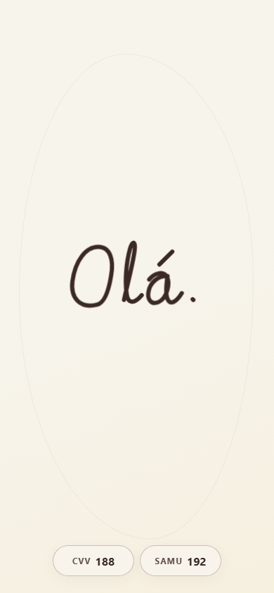
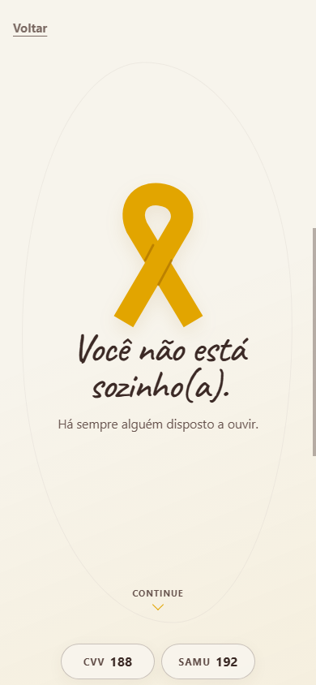
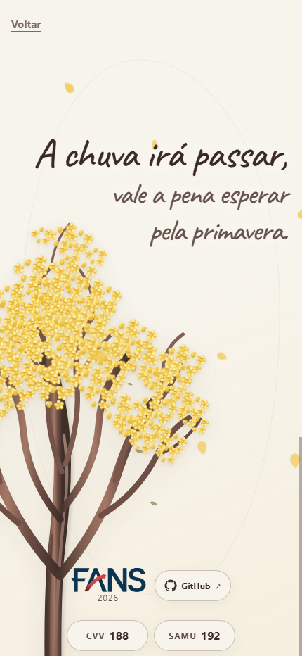
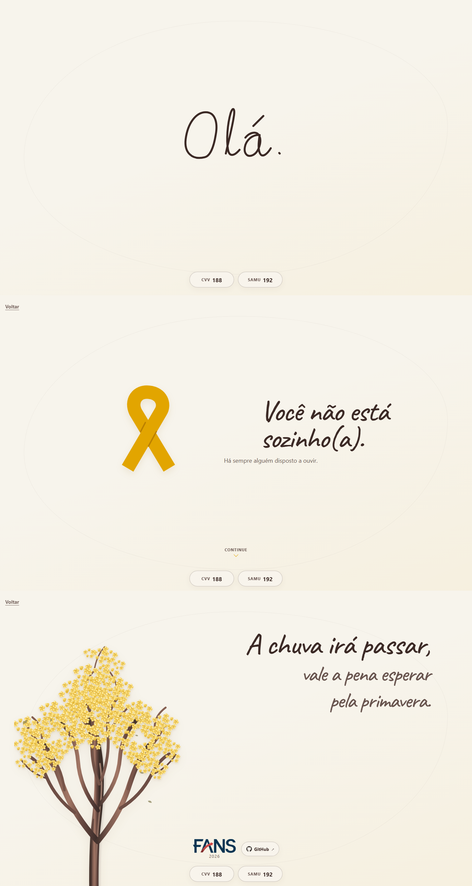

# Setembro Amarelo — você não está sozinho

Experiência web mobile criada para a campanha do Setembro Amarelo da Faculdade FANS. A página conduz o visitante por três momentos curtos — contato, acolhimento e esperança — mantendo os telefones de apoio visíveis durante todo o percurso.

> **Precisa conversar?** Ligue gratuitamente para o **CVV pelo 188**. Em uma emergência ou situação de risco imediato, ligue para o **SAMU pelo 192**.

## Sobre o projeto

O acesso foi pensado principalmente para celulares, por meio de QR codes exibidos nos telões da faculdade. A experiência combina tipografia manuscrita, ilustrações vetoriais e animações suaves em uma página estática, rápida e funcional mesmo sem conexão depois que os arquivos são carregados.

O projeto não utiliza framework, backend, cookies, analytics ou dependências externas de execução. Todo o conteúdo visual, inclusive fonte, logo e SVGs, está armazenado localmente.

## Experiência visual

As capturas abaixo foram geradas diretamente da implementação em uma viewport mobile. Cada imagem documenta o estado completo do respectivo quadro.

### 1. Primeiro contato

A palavra “Olá.” é desenhada como escrita à mão. A introdução dura três segundos, pode ser concluída com um toque em uma área vazia e nunca bloqueia os atalhos de telefone.



### 2. Acolhimento

O laço amarelo é formado por uma animação de traço e acompanha a mensagem “Você não está sozinho(a).”. É possível avançar tocando no controle, arrastando-o cerca de 30 px para cima ou usando o teclado.



### 3. Esperança e apoio

O último quadro apresenta o poema autoral, um ipê-amarelo animado, a identificação da Faculdade FANS e o acesso ao repositório. Folhas atravessam a cena sem capturar cliques ou interferir nos contatos.



### Visão geral em desktop

Em telas largas, a composição se adapta sem perder a ordem narrativa ou o acesso aos controles.



## Como executar

O projeto não precisa de instalação ou compilação. Sirva a pasta com qualquer servidor HTTP local; por exemplo:

```bash
python -m http.server 4173
```

Depois, abra `http://localhost:4173` no navegador. Usar um servidor local é recomendado porque os módulos JavaScript não funcionam de forma consistente quando o HTML é aberto diretamente pelo protocolo `file://`.

## Interações

- **Quadro 1:** avança automaticamente após três segundos; um toque em área vazia conclui a introdução.
- **Quadro 2:** toque, clique, `Enter`, barra de espaço ou gesto vertical no controle levam ao quadro final.
- **Quadros 2 e 3:** o link `Voltar` retorna ao quadro anterior e reinicia sua animação.
- **Rolagem:** `scroll-snap` alinha cada quadro à área visível sem impedir conteúdo ampliado ou telas baixas.
- **Ajuda:** `CVV 188` e `SAMU 192` são links `tel:` disponíveis nos três quadros.

Links e controles sempre têm prioridade sobre os gestos da cena. Tocar em uma área vazia apenas conclui a animação atual; não inicia chamadas nem ativa links.

## Acessibilidade e segurança

- HTML semântico e títulos em ordem lógica;
- navegação por toque, mouse e teclado;
- foco visível em todos os elementos interativos;
- alvos de toque com pelo menos 44 × 44 CSS pixels;
- nomes acessíveis para telefones, navegação e GitHub;
- ilustrações decorativas ocultas de leitores de tela;
- contraste compatível com WCAG AA para textos e controles;
- suporte a zoom de 200%, orientação horizontal e áreas seguras do aparelho;
- experiência estática completa com `prefers-reduced-motion: reduce`;
- conteúdo e telefones acessíveis mesmo quando o JavaScript não executa;
- ausência de formulários, rastreadores e coleta de dados.

## Arquitetura

```text
setembro-amarelo/
├── index.html
├── css/
│   └── style.css
├── js/
│   ├── main.js
│   └── animations.js
├── assets/
│   ├── fonts/
│   │   ├── caveat.woff2
│   │   └── OFL.txt
│   ├── arvore.svg
│   ├── fans-logo.png
│   ├── github-icon.svg
│   └── laco.svg
├── docs/
│   ├── options/
│   └── screenshots/
└── tools/
    └── qa-and-capture.mjs
```

### Responsabilidades

- `index.html` contém a estrutura semântica dos três quadros e todos os caminhos de navegação.
- `css/style.css` reúne layout responsivo, identidade visual, animações e preferências de acessibilidade.
- `js/main.js` coordena navegação, gestos, rolagem e ciclo ativo dos quadros.
- `js/animations.js` controla temporizadores, conclusão e reinício das animações.
- `tools/qa-and-capture.mjs` executa verificações no Chrome via DevTools Protocol e atualiza as capturas da documentação.

## Decisões de implementação

- A página usa apenas HTML, CSS e JavaScript modular; GSAP não foi necessário.
- A fonte Caveat é distribuída localmente com sua licença SIL Open Font License.
- O laço e o ipê são SVGs locais, reduzindo requisições e permitindo animações leves.
- As animações priorizam `transform` e `opacity` para evitar recálculos frequentes de layout.
- `100svh`, `100dvh` e `env(safe-area-inset-*)` acomodam barras dinâmicas e recortes de celulares.
- Em telas horizontais, baixas ou com texto ampliado, o encaixe é suavizado e o conteúdo pode crescer verticalmente.
- O bloqueio da introdução só é ativado depois que o módulo JavaScript inicia com sucesso.

## Validação

O utilitário de QA foi executado no Chrome desktop com viewports móveis emuladas.

| Área | Resultado |
| --- | --- |
| Viewports | 320, 360, 390, 412, 768 e 1440 px sem estouro horizontal |
| Orientação horizontal | 844 × 390 px com conteúdo rolável e encaixe não restritivo |
| Fluxo | introdução automática, conclusão por toque, avanço por toque/arrasto e retorno verificados |
| Teclado | ordem de foco preservada; avanço por `Enter` e espaço |
| Telefones | seis links locais validados como `tel:188` e `tel:192` |
| Movimento reduzido | esperas e animações decorativas removidas; navegação direta preservada |
| Sem JavaScript | três quadros, títulos e telefones visíveis; rolagem liberada |
| Zoom de 200% | página rolável, contatos preservados e alvos com ao menos 44 px |
| Contraste | texto principal 12,49:1; texto secundário 6,54:1; foco 5,94:1 |
| Recursos | HTML, CSS, módulos, fonte, logo e SVGs carregados localmente |
| Sintaxe | módulos JavaScript e utilitário de QA aprovados por `node --check` |

Safari em iPhone e Chrome em Android físicos não estavam disponíveis no ambiente automatizado. Antes da apresentação, recomenda-se um teste curto nesses aparelhos para confirmar as barras dinâmicas do navegador e a abertura do discador.

## Regenerar as capturas

O script de QA espera:

1. o site disponível em `http://127.0.0.1:4173/`;
2. um navegador Chromium com depuração remota em `http://127.0.0.1:9222`.

Com ambos ativos, execute:

```bash
node tools/qa-and-capture.mjs
```

As imagens são gravadas em `docs/screenshots/`. O processo também valida navegação por gesto, retorno ao primeiro quadro, movimento reduzido, ausência de JavaScript e zoom de 200%.

## Referências de conteúdo

- [CVV — Centro de Valorização da Vida](https://cvv.org.br/o-cvv/) — atendimento gratuito pelo 188, 24 horas por dia.
- [Ministério da Saúde — SAMU 192](https://www.gov.br/saude/pt-br/composicao/saes/samu-192) — serviço gratuito de urgência e emergência.
- [W3C — Animation from Interactions](https://www.w3.org/WAI/WCAG21/Understanding/animation-from-interactions.html) — orientação sobre movimento e preferências do usuário.

## Créditos

Projeto acadêmico desenvolvido para a **Faculdade FANS**, em 2026. O poema e as ilustrações da experiência fazem parte deste projeto.
